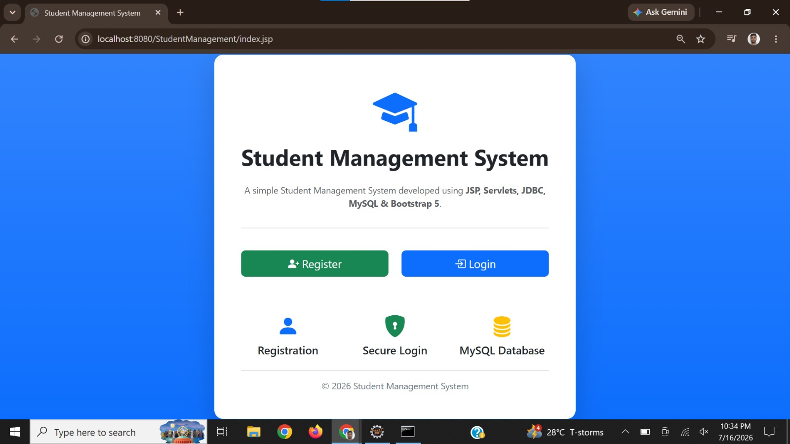
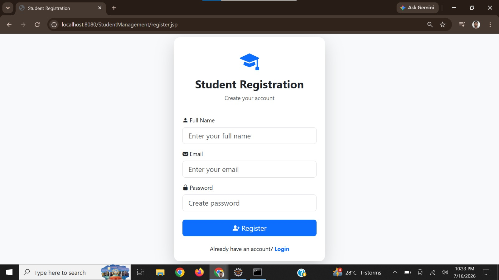
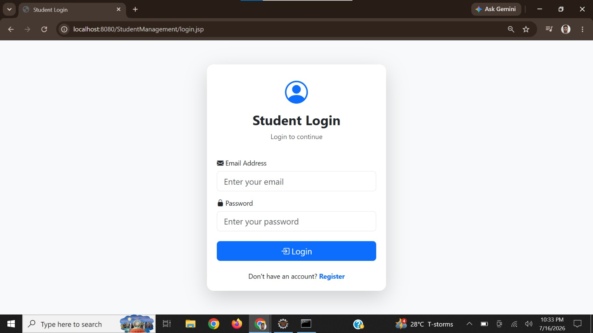
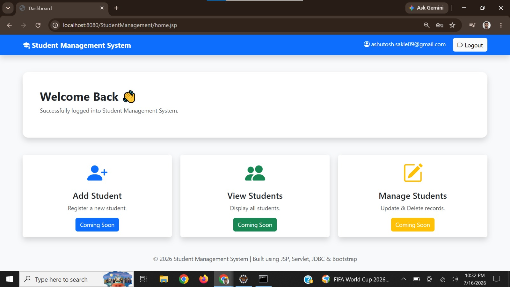
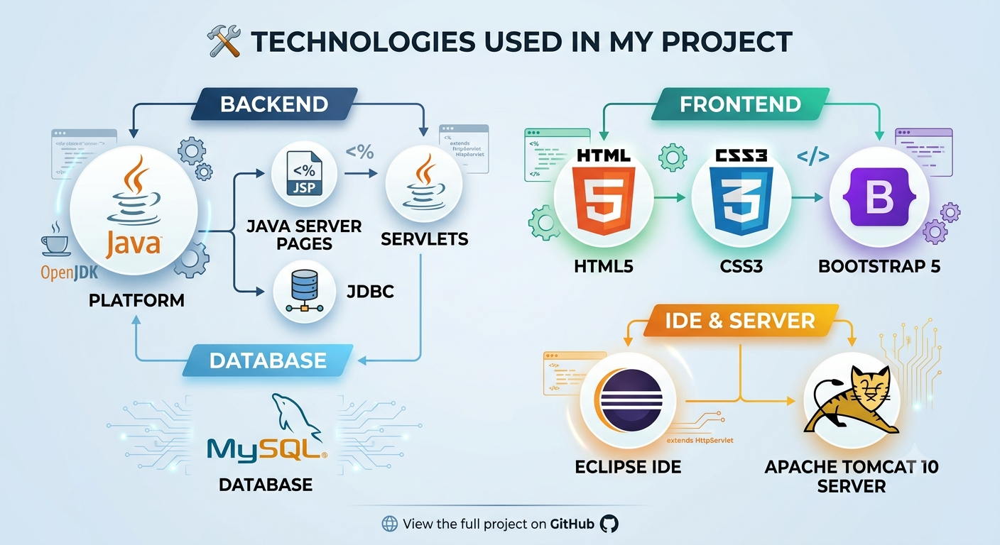

# 🎓 Student Management System

A Java Web Application developed using **JSP, Servlets, JDBC, MySQL, and Bootstrap 5**. This project demonstrates user authentication, session management, database connectivity, and the MVC (Model-View-Controller) architecture.


---
## 📸 Application Screenshots

### 🏠 Home Page



---


### 📝 Registration Page



---

### 🔐 Login Page



---

### 📊 Dashboard



---
### add student

---

## view all student 


## update and delete


---
### 🛠️ Technologies Used


---

## 📌 Project Overview

The Student Management System is a Java web application that allows users to register, log in, and access a secure dashboard. It is designed to demonstrate the integration of JSP, Servlets, JDBC, and MySQL while following the MVC architecture.

---

## ✨ Features

- ✅ User Registration
- ✅ Duplicate Email Validation
- ✅ User Login Authentication
- ✅ Session Management
- ✅ Logout Functionality
- ✅ Secure Pages using Session
- ✅ MySQL Database Integration
- ✅ Responsive UI using Bootstrap 5
- ✅ MVC Architecture

---

## 🛠️ Technologies Used

### Backend
- Java
- JSP
- Servlets
- JDBC

### Frontend
- HTML5
- CSS3
- Bootstrap 5

### Database
- MySQL

### IDE & Server
- Eclipse IDE
- Apache Tomcat 10

---

## 📂 Project Structure

```
StudentManagement
│
├── src
│   ├── com.db
│   ├── com.dao
│   ├── com.model
│   └── com.servlet
│
├── WebContent
│   ├── css
│   ├── register.jsp
│   ├── login.jsp
│   ├── home.jsp
│   └── index.jsp
│
└── MySQL Database
```

---

## 🔄 Application Flow

```
Home Page
     │
     ▼
Registration
     │
     ▼
Login
     │
     ▼
Dashboard (Session)
     │
     ▼
Logout
```

---

## 🗄️ Database

Database Name

```
student_db
```

Table

```
users
```

Columns

| Column | Type |
|---------|------|
| id | INT |
| name | VARCHAR |
| email | VARCHAR |
| password | VARCHAR |

---

## 🚀 How to Run

1. Clone the repository

```
git clone https://github.com/ashutosh-sakle09/StudentManagementSystem_Advance--java.git
```

2. Import the project into Eclipse.

3. Configure Apache Tomcat.

4. Create the MySQL database.

5. Update database credentials in `DBConnection.java`.

6. Run the project on Tomcat.

---

## 📸 Screenshots

- Home Page
- Registration Page
- Login Page
- Dashboard

(Add screenshots here)

---

## 📚 Learning Outcomes

- JSP & Servlet Integration
- JDBC with MySQL
- MVC Architecture
- Session Management
- Form Validation
- Bootstrap UI Development
- CRUD Application Development

---

## 👨‍💻 Author

**Ashutosh Sakle**

Java Backend Developer

GitHub:
https://github.com/ashutosh-sakle09

---

⭐ If you found this project helpful, don't forget to give it a Star.
